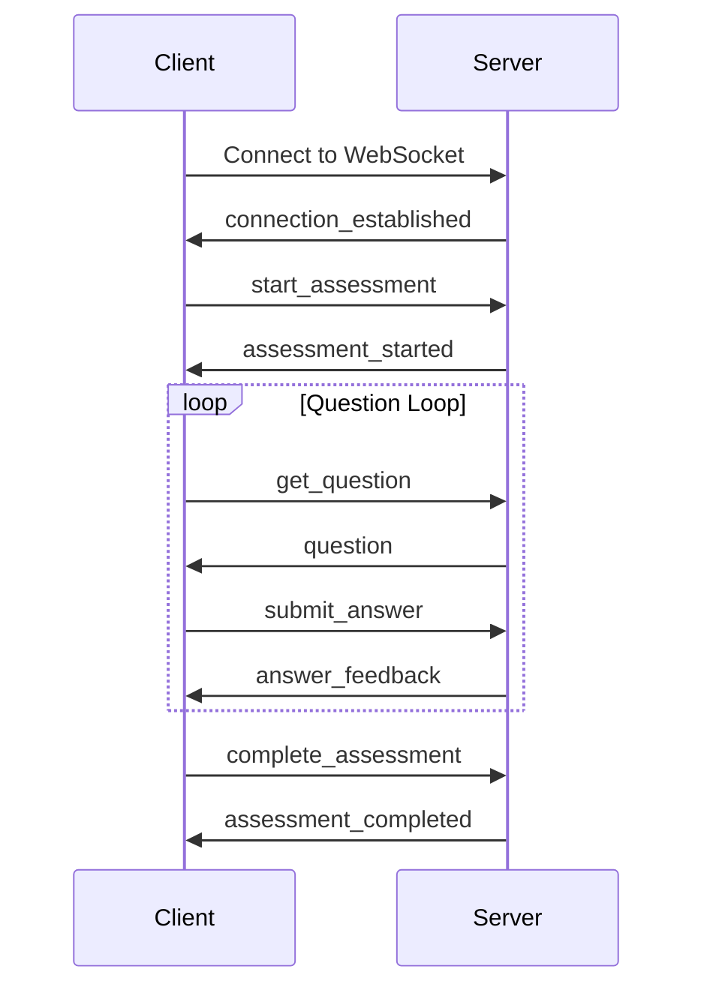

# Frontend WebSocket Integration Guide

## Overview

This guide provides comprehensive documentation for frontend developers to integrate with the Jatayu AI Quiz Backend WebSocket API. The system supports real-time assessment delivery with automatic reconnection, state recovery, and single connection enforcement.

## Table of Contents

1. [Connection Establishment](#connection-establishment)
2. [Authentication](#authentication)
3. [Message Protocol](#message-protocol)
4. [Assessment Flow](#assessment-flow)
5. [Error Handling](#error-handling)
6. [Reconnection & State Recovery](#reconnection--state-recovery)
7. [Code Examples](#code-examples)
8. [Best Practices](#best-practices)

---

## Connection Establishment

### WebSocket Endpoint

```
ws://localhost:8000/ws/assessment/{test_id}?token={jwt_token}
```

### Parameters

- `test_id`: Integer ID of the test to take
- `token`: JWT authentication token (URL-encoded)

### Connection Flow

1. **Authentication**: Server validates JWT token
2. **Authorization**: Server checks test access permissions
3. **Single Connection Policy**: Any existing connection for the user is automatically disconnected
4. **Connection Established**: Server sends connection confirmation

---

## Authentication

### JWT Token Requirements

Your JWT token must contain:

```json
{
  "user_id": 123,
  "exp": 1640995200
  // other claims...
}
```

### Example Connection

```javascript
const token = "eyJhbGciOiJIUzI1NiIsInR5cCI6IkpXVCJ9...";
const testId = 42;
const wsUrl = `ws://localhost:8000/ws/assessment/${testId}?token=${encodeURIComponent(
  token
)}`;

const websocket = new WebSocket(wsUrl);
```

---

## Message Protocol

All messages are JSON objects with a `type` field indicating the message purpose.

### Message Structure

```typescript
interface WebSocketMessage {
  type: string;
  data?: any;
  error?: string;
  timestamp?: string;
}
```

### Message Types

#### 1. Connection Messages

**Connection Established**

```json
{
  "type": "connection_established",
  "data": {
    "connection_id": "123_1640995200.123",
    "user_id": 123,
    "test_id": 42,
    "message": "Connection established successfully"
  }
}
```

**Connection Error**

```json
{
  "type": "error",
  "error": "Authentication failed",
  "data": {
    "code": "AUTH_FAILED",
    "details": "Invalid or expired token"
  }
}
```

#### 2. Assessment Control Messages

**Start Assessment Request** (Client → Server)

```json
{
  "type": "start_assessment",
  "data": {
    "test_id": 42
  }
}
```

**Assessment Started Response** (Server → Client)

```json
{
  "type": "assessment_started",
  "data": {
    "assessment_id": 789,
    "thread_id": "789",
    "test_id": 42,
    "message": "Assessment session started successfully"
  }
}
```

**Assessment Recovery** (Server → Client)

```json
{
  "type": "assessment_recovered",
  "data": {
    "assessment_id": 789,
    "thread_id": "789",
    "progress": {
      "answered_questions": 3,
      "total_questions": 10,
      "percentage_complete": 30
    },
    "message": "Previous assessment session recovered"
  }
}
```

#### 3. Question Messages

**Request Next Question** (Client → Server)

```json
{
  "type": "get_question"
}
```

**Question Delivered** (Server → Client)

```json
{
  "type": "question",
  "data": {
    "question_id": "q_001",
    "thread_id": "789",
    "question": {
      "text": "What is the primary purpose of async/await in JavaScript?",
      "options": [
        { "id": "A", "text": "To handle synchronous operations" },
        { "id": "B", "text": "To handle asynchronous operations" },
        { "id": "C", "text": "To create loops" },
        { "id": "D", "text": "To define variables" }
      ],
      "difficulty": "medium",
      "skill": "JavaScript Programming",
      "time_limit": 60
    }
  }
}
```

#### 4. Answer Submission Messages

**Submit Answer** (Client → Server)

```json
{
  "type": "submit_answer",
  "data": {
    "question_id": "q_001",
    "selected_option": "B"
  }
}
```

**Answer Feedback** (Server → Client)

```json
{
  "type": "answer_feedback",
  "data": {
    "question_id": "q_001",
    "feedback": {
      "correct": true,
      "selected_option": "B",
      "correct_answer": "B",
      "message": "Correct answer!"
    },
    "progress": {
      "answered": 4,
      "total": 10,
      "percentage_complete": 40
    },
    "thread_id": "789"
  }
}
```

#### 5. Progress Messages

**Get Progress** (Client → Server)

```json
{
  "type": "get_progress"
}
```

**Progress Update** (Server → Client)

```json
{
  "type": "progress_update",
  "data": {
    "total_questions": 10,
    "answered_questions": 5,
    "percentage_complete": 50,
    "thread_id": "789"
  }
}
```

#### 6. Assessment Completion

**Complete Assessment** (Client → Server)

```json
{
  "type": "complete_assessment"
}
```

**Assessment Results** (Server → Client)

```json
{
  "type": "assessment_completed",
  "data": {
    "final_score": 85.5,
    "correct_answers": 8,
    "total_questions": 10,
    "assessment_id": 789,
    "thread_id": "789",
    "message": "Assessment completed successfully"
  }
}
```

---

## Assessment Flow

### Typical Assessment Sequence



### State Management

The system maintains state across the entire assessment:

1. **Connection State**: User identity, test context
2. **Assessment State**: Progress, current question, answers
3. **Graph State**: AI conversation context, question generation state

---

## Error Handling

### Error Message Format

```json
{
  "type": "error",
  "error": "Error description",
  "data": {
    "code": "ERROR_CODE",
    "details": "Additional error details",
    "recoverable": true
  }
}
```

### Common Error Codes

| Code                | Description                | Action            |
| ------------------- | -------------------------- | ----------------- |
| `AUTH_FAILED`       | Invalid/expired token      | Re-authenticate   |
| `ACCESS_DENIED`     | No permission for test     | Check eligibility |
| `TEST_NOT_FOUND`    | Test doesn't exist         | Verify test ID    |
| `ASSESSMENT_FAILED` | Can't start assessment     | Contact support   |
| `QUESTION_ERROR`    | Question generation failed | Retry or report   |
| `INVALID_ANSWER`    | Answer format invalid      | Resubmit properly |
| `SESSION_EXPIRED`   | Assessment timed out       | Start new attempt |

### Error Handling Example

```javascript
websocket.onmessage = (event) => {
  const message = JSON.parse(event.data);

  if (message.type === "error") {
    const { error, data } = message;

    switch (data?.code) {
      case "AUTH_FAILED":
        // Redirect to login
        window.location.href = "/login";
        break;

      case "SESSION_EXPIRED":
        // Show timeout message
        showTimeoutDialog();
        break;

      case "QUESTION_ERROR":
        if (data?.recoverable) {
          // Retry getting question
          retryGetQuestion();
        } else {
          // Show error to user
          showError(error);
        }
        break;

      default:
        showError(error);
    }
  }
};
```

---

## Reconnection & State Recovery

### Automatic Reconnection

The system supports seamless reconnection with state recovery:

1. **Detection**: Client detects connection loss
2. **Reconnection**: Client reconnects with same credentials
3. **Recovery**: Server recovers previous assessment state
4. **Continuation**: Assessment continues from where it left off

### Reconnection Implementation

```javascript
class AssessmentWebSocket {
  constructor(testId, token) {
    this.testId = testId;
    this.token = token;
    this.reconnectAttempts = 0;
    this.maxReconnectAttempts = 5;
    this.reconnectDelay = 1000; // Start with 1 second
    this.connect();
  }

  connect() {
    const wsUrl = `ws://localhost:8000/ws/assessment/${
      this.testId
    }?token=${encodeURIComponent(this.token)}`;
    this.websocket = new WebSocket(wsUrl);

    this.websocket.onopen = this.onOpen.bind(this);
    this.websocket.onmessage = this.onMessage.bind(this);
    this.websocket.onclose = this.onClose.bind(this);
    this.websocket.onerror = this.onError.bind(this);
  }

  onOpen() {
    console.log("WebSocket connected");
    this.reconnectAttempts = 0;
    this.reconnectDelay = 1000;

    // Request assessment state recovery
    this.send({
      type: "start_assessment",
      data: { test_id: this.testId },
    });
  }

  onClose(event) {
    console.log("WebSocket disconnected:", event.code, event.reason);

    if (!event.wasClean && this.reconnectAttempts < this.maxReconnectAttempts) {
      this.scheduleReconnect();
    }
  }

  onError(error) {
    console.error("WebSocket error:", error);
  }

  scheduleReconnect() {
    this.reconnectAttempts++;

    console.log(
      `Scheduling reconnect attempt ${this.reconnectAttempts} in ${this.reconnectDelay}ms`
    );

    setTimeout(() => {
      this.connect();
    }, this.reconnectDelay);

    // Exponential backoff
    this.reconnectDelay = Math.min(this.reconnectDelay * 2, 30000);
  }

  send(message) {
    if (this.websocket.readyState === WebSocket.OPEN) {
      this.websocket.send(JSON.stringify(message));
    } else {
      console.warn("WebSocket not connected, message queued");
      // You might want to queue messages here
    }
  }
}
```

---

## Code Examples

### Complete React Hook Implementation

```typescript
import { useState, useEffect, useRef, useCallback } from "react";

interface Question {
  text: string;
  options: Array<{
    id: string;
    text: string;
  }>;
  difficulty: string;
  skill: string;
  time_limit: number;
}

interface Progress {
  answered: number;
  total: number;
  percentage_complete: number;
}

interface AssessmentState {
  connected: boolean;
  assessmentStarted: boolean;
  currentQuestion: Question | null;
  progress: Progress | null;
  error: string | null;
  completed: boolean;
  finalScore: number | null;
}

export const useAssessmentWebSocket = (testId: number, token: string) => {
  const [state, setState] = useState<AssessmentState>({
    connected: false,
    assessmentStarted: false,
    currentQuestion: null,
    progress: null,
    error: null,
    completed: false,
    finalScore: null,
  });

  const websocketRef = useRef<WebSocket | null>(null);
  const reconnectTimeoutRef = useRef<NodeJS.Timeout>();
  const reconnectAttemptsRef = useRef(0);

  const connect = useCallback(() => {
    const wsUrl = `ws://localhost:8000/ws/assessment/${testId}?token=${encodeURIComponent(
      token
    )}`;
    const ws = new WebSocket(wsUrl);

    ws.onopen = () => {
      console.log("Connected to assessment WebSocket");
      websocketRef.current = ws;
      reconnectAttemptsRef.current = 0;

      setState((prev) => ({ ...prev, connected: true, error: null }));
    };

    ws.onmessage = (event) => {
      const message = JSON.parse(event.data);
      handleMessage(message);
    };

    ws.onclose = (event) => {
      websocketRef.current = null;
      setState((prev) => ({ ...prev, connected: false }));

      if (!event.wasClean && reconnectAttemptsRef.current < 5) {
        scheduleReconnect();
      }
    };

    ws.onerror = (error) => {
      console.error("WebSocket error:", error);
      setState((prev) => ({ ...prev, error: "Connection error occurred" }));
    };
  }, [testId, token]);

  const scheduleReconnect = useCallback(() => {
    reconnectAttemptsRef.current++;
    const delay = Math.min(
      1000 * Math.pow(2, reconnectAttemptsRef.current - 1),
      30000
    );

    reconnectTimeoutRef.current = setTimeout(() => {
      connect();
    }, delay);
  }, [connect]);

  const handleMessage = (message: any) => {
    switch (message.type) {
      case "connection_established":
        // Auto-start assessment
        startAssessment();
        break;

      case "assessment_started":
        setState((prev) => ({
          ...prev,
          assessmentStarted: true,
          error: null,
        }));
        // Request first question
        requestQuestion();
        break;

      case "assessment_recovered":
        setState((prev) => ({
          ...prev,
          assessmentStarted: true,
          progress: message.data.progress,
          error: null,
        }));
        // Request current question
        requestQuestion();
        break;

      case "question":
        setState((prev) => ({
          ...prev,
          currentQuestion: message.data.question,
          error: null,
        }));
        break;

      case "answer_feedback":
        setState((prev) => ({
          ...prev,
          progress: message.data.progress,
        }));
        // Auto-request next question
        if (message.data.progress.answered < message.data.progress.total) {
          setTimeout(() => requestQuestion(), 1000);
        }
        break;

      case "progress_update":
        setState((prev) => ({
          ...prev,
          progress: message.data,
        }));
        break;

      case "assessment_completed":
        setState((prev) => ({
          ...prev,
          completed: true,
          finalScore: message.data.final_score,
        }));
        break;

      case "error":
        setState((prev) => ({
          ...prev,
          error: message.error,
        }));
        break;
    }
  };

  const sendMessage = useCallback((message: any) => {
    if (websocketRef.current?.readyState === WebSocket.OPEN) {
      websocketRef.current.send(JSON.stringify(message));
    }
  }, []);

  const startAssessment = useCallback(() => {
    sendMessage({
      type: "start_assessment",
      data: { test_id: testId },
    });
  }, [sendMessage, testId]);

  const requestQuestion = useCallback(() => {
    sendMessage({ type: "get_question" });
  }, [sendMessage]);

  const submitAnswer = useCallback(
    (questionId: string, selectedOption: string) => {
      sendMessage({
        type: "submit_answer",
        data: {
          question_id: questionId,
          selected_option: selectedOption,
        },
      });
    },
    [sendMessage]
  );

  const completeAssessment = useCallback(() => {
    sendMessage({ type: "complete_assessment" });
  }, [sendMessage]);

  const getProgress = useCallback(() => {
    sendMessage({ type: "get_progress" });
  }, [sendMessage]);

  useEffect(() => {
    connect();

    return () => {
      if (reconnectTimeoutRef.current) {
        clearTimeout(reconnectTimeoutRef.current);
      }
      if (websocketRef.current) {
        websocketRef.current.close();
      }
    };
  }, [connect]);

  return {
    ...state,
    submitAnswer,
    completeAssessment,
    getProgress,
    requestQuestion,
  };
};
```

### React Component Usage

```tsx
import React, { useState } from "react";
import { useAssessmentWebSocket } from "./useAssessmentWebSocket";

const AssessmentComponent: React.FC = () => {
  const testId = 42;
  const token = localStorage.getItem("authToken") || "";

  const {
    connected,
    assessmentStarted,
    currentQuestion,
    progress,
    error,
    completed,
    finalScore,
    submitAnswer,
    completeAssessment,
  } = useAssessmentWebSocket(testId, token);

  const [selectedOption, setSelectedOption] = useState<string>("");

  const handleSubmitAnswer = () => {
    if (currentQuestion && selectedOption) {
      submitAnswer("current_question_id", selectedOption);
      setSelectedOption("");
    }
  };

  if (error) {
    return <div className="error">Error: {error}</div>;
  }

  if (!connected) {
    return <div className="loading">Connecting to assessment...</div>;
  }

  if (completed) {
    return (
      <div className="completion">
        <h2>Assessment Completed!</h2>
        <p>Your Score: {finalScore}%</p>
      </div>
    );
  }

  if (!assessmentStarted) {
    return <div className="loading">Starting assessment...</div>;
  }

  if (!currentQuestion) {
    return <div className="loading">Loading question...</div>;
  }

  return (
    <div className="assessment">
      {progress && (
        <div className="progress">
          Progress: {progress.answered}/{progress.total} (
          {progress.percentage_complete.toFixed(1)}%)
        </div>
      )}

      <div className="question">
        <h3>{currentQuestion.text}</h3>

        <div className="options">
          {currentQuestion.options.map((option) => (
            <label key={option.id} className="option">
              <input
                type="radio"
                name="answer"
                value={option.id}
                checked={selectedOption === option.id}
                onChange={(e) => setSelectedOption(e.target.value)}
              />
              {option.text}
            </label>
          ))}
        </div>

        <button
          onClick={handleSubmitAnswer}
          disabled={!selectedOption}
          className="submit-btn"
        >
          Submit Answer
        </button>
      </div>

      {progress?.answered === progress?.total && (
        <button onClick={completeAssessment} className="complete-btn">
          Complete Assessment
        </button>
      )}
    </div>
  );
};

export default AssessmentComponent;
```

---

## Best Practices

### 1. Connection Management

- **Always handle reconnection**: Network issues are common
- **Implement exponential backoff**: Prevent server overload
- **Clean up connections**: Avoid memory leaks

### 2. State Management

- **Trust server state**: Server maintains authoritative state
- **Handle recovery gracefully**: Users expect seamless reconnection
- **Show connection status**: Keep users informed

### 3. User Experience

- **Loading states**: Show progress during connections/requests
- **Error feedback**: Provide clear, actionable error messages
- **Offline handling**: Handle network disconnections gracefully

### 4. Security

- **Secure token storage**: Use appropriate storage mechanisms
- **Token refresh**: Handle token expiration
- **Validate inputs**: Client-side validation for better UX

### 5. Performance

- **Message queuing**: Queue messages during disconnection
- **Debounce rapid actions**: Prevent message flooding
- **Cleanup timeouts**: Clear intervals and timeouts

### 6. Testing

- **Test reconnection**: Simulate network issues
- **Test recovery**: Verify state recovery works
- **Test error scenarios**: Handle various error conditions

---

## Troubleshooting

### Common Issues

1. **Connection Fails**

   - Check WebSocket URL format
   - Verify JWT token is valid and not expired
   - Ensure test_id exists and is accessible

2. **No Questions Received**

   - Verify assessment was started successfully
   - Check if assessment is in recoverable state
   - Look for error messages

3. **Answers Not Accepted**

   - Ensure question_id matches current question
   - Verify option format (usually single character)
   - Check if assessment is still active

4. **Reconnection Issues**
   - Implement proper error handling
   - Use exponential backoff
   - Check server-side connection limits

### Debug Tips

```javascript
// Enable debug logging
websocket.onmessage = (event) => {
  console.log("📨 Received:", JSON.parse(event.data));
  // ... handle message
};

websocket.send = (data) => {
  console.log("📤 Sending:", JSON.parse(data));
  WebSocket.prototype.send.call(websocket, data);
};
```

---

## Support

For technical support or questions:

- Check server logs for detailed error information
- Verify network connectivity and WebSocket support
- Contact the backend development team with connection details

---

_This documentation covers the complete frontend integration for the Jatayu AI Quiz Backend WebSocket API. Keep this guide updated as the API evolves._
