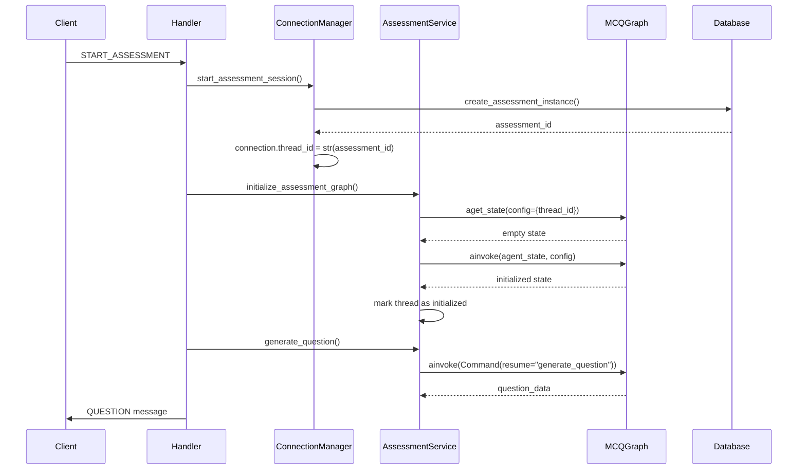
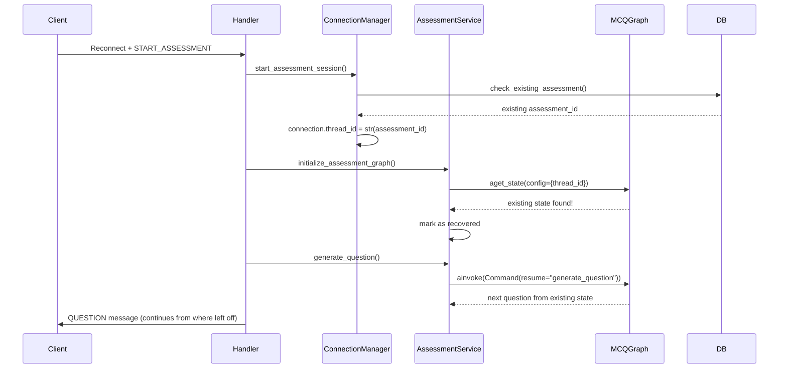

# Thread ID Management for MCQ Generation Graph

## Overview

The WebSocket system has been updated to properly handle thread_id management for the MCQ generation graph, ensuring state persistence and recovery across disconnections and reconnections.

## Key Concepts

### Thread ID = Assessment ID

- Each assessment instance gets a unique `assessment_id` from the database
- This `assessment_id` is used as the `thread_id` for the MCQ generation graph
- This ensures 1:1 mapping between database records and graph state

### State Persistence

- LangGraph automatically persists state using the `thread_id`
- State includes generated questions, candidate responses, and progress
- State survives server restarts and connection drops

## Implementation Details

### Connection State Updates

```python
class ConnectionState:
    # ...existing fields...
    thread_id: Optional[str] = None  # Same as assessment_id for graph persistence
    graph_initialized: bool = False  # Tracks if graph has been initialized
```

### Assessment Service Architecture

```python
class AssessmentGraphService:
    def __init__(self):
        self.graph = None
        # Track initialized threads to prevent re-initialization
        self.initialized_threads: Dict[str, bool] = {}
```

## Critical Rules

### 1. Never Reinitialize with Existing Thread ID

```python
# WRONG - This will lose existing state
if thread_id in existing_threads:
    state = await graph.ainvoke(agent_state, config=config)  # BAD!

# CORRECT - Check for existing state first
existing_state = await graph.aget_state(config)
if existing_state.values:
    # State exists, can continue with Command(resume=...)
    logger.info("Recovering existing state")
else:
    # No state, safe to initialize
    state = await graph.ainvoke(agent_state, config=config)
```

### 2. Use Command(resume=...) for All Interactions

```python
# Generate question
command = Command(resume={"type": "generate_question"})
result = await graph.ainvoke(command, config=config)

# Submit answer
command = Command(resume={
    "type": "submit_response",
    "payload": {
        "question_id": question_id,
        "selected_option": selected_option
    }
})
result = await graph.ainvoke(command, config=config)
```

### 3. Proper Config Management

```python
config = RunnableConfig(
    configurable={"thread_id": str(assessment_id)}
)
```

## Flow Diagrams

### Initial Assessment Start



### Reconnection During Assessment



## Error Prevention

### Common Mistakes to Avoid

1. **Reinitializing with existing thread_id**:

   ```python
   # DON'T DO THIS
   await graph.ainvoke(agent_state, config=config)  # Will overwrite existing state
   ```

2. **Not checking for existing state**:

   ```python
   # ALWAYS check first
   existing_state = await graph.aget_state(config)
   if not existing_state.values:
       # Safe to initialize
   ```

3. **Using different thread_id formats**:
   ```python
   # CONSISTENT - always use string
   thread_id = str(assessment_id)
   ```

## Monitoring and Debugging

### State Inspection

```python
# Check current state
state = await graph.aget_state(config)
print(f"State values: {state.values}")
print(f"Generated questions: {state.values.get('generated_questions', {})}")
print(f"Responses: {state.values.get('candidate_response', {})}")

# Check state history
async for checkpoint in graph.aget_state_history(config):
    print(f"Checkpoint: {checkpoint}")
```

### Connection Information

```python
# Get thread_id for connection
thread_id = connection_manager.get_connection_thread_id(connection_id)

# Get connection info including thread_id
info = connection_manager.get_connection_info(connection_id)
print(f"Thread ID: {info['thread_id']}")
print(f"Graph initialized: {info['graph_initialized']}")
```

## Recovery Scenarios

### Scenario 1: Network Disconnection

1. User loses connection during assessment
2. Graph state remains in persistence layer
3. User reconnects with same credentials
4. System detects existing assessment
5. Recovers thread_id and continues from last state

### Scenario 2: Server Restart

1. Server restarts while assessments in progress
2. Graph persistence layer retains all thread states
3. Users reconnect after server restart
4. Assessments continue seamlessly

### Scenario 3: Browser Refresh

1. User refreshes browser during assessment
2. New WebSocket connection established
3. Same assessment_id used as thread_id
4. Graph state recovered automatically

## Best Practices

1. **Always use assessment_id as thread_id** for consistency
2. **Check existing state before initialization** to prevent overwrites
3. **Use Command(resume=...) for all graph interactions** after initialization
4. **Track initialization state** to prevent duplicate initialization
5. **Implement proper error handling** for state recovery failures
6. **Log thread_id in all operations** for debugging
7. **Test reconnection scenarios** thoroughly

This implementation ensures robust assessment delivery with seamless state management and recovery capabilities.
