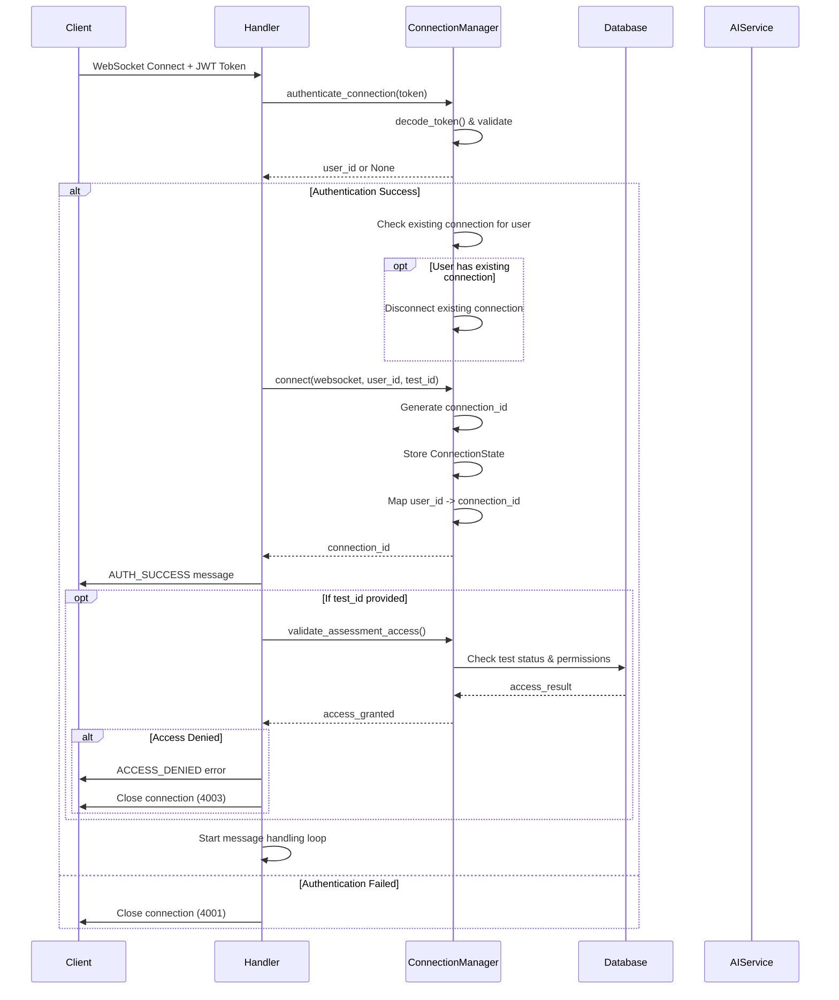
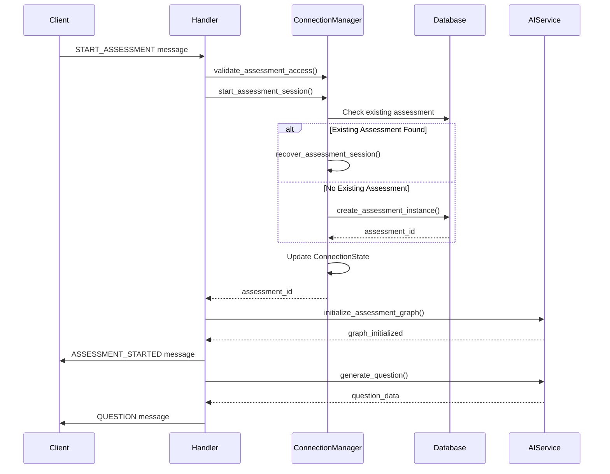
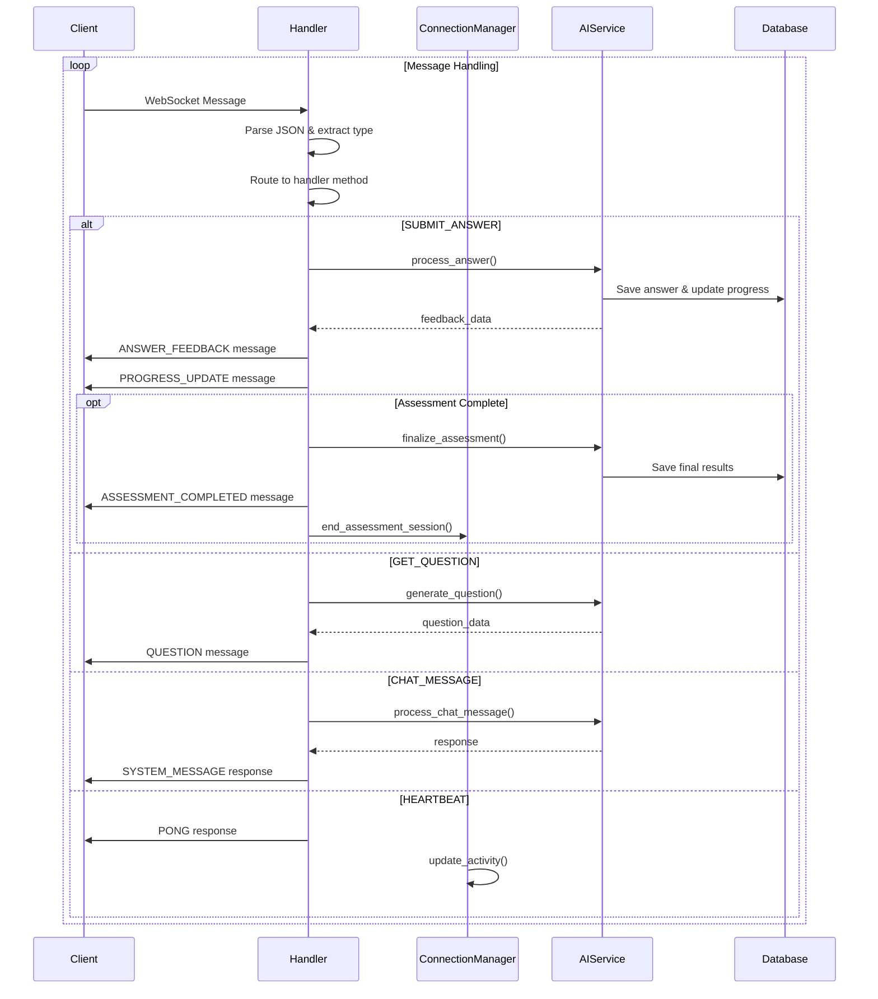
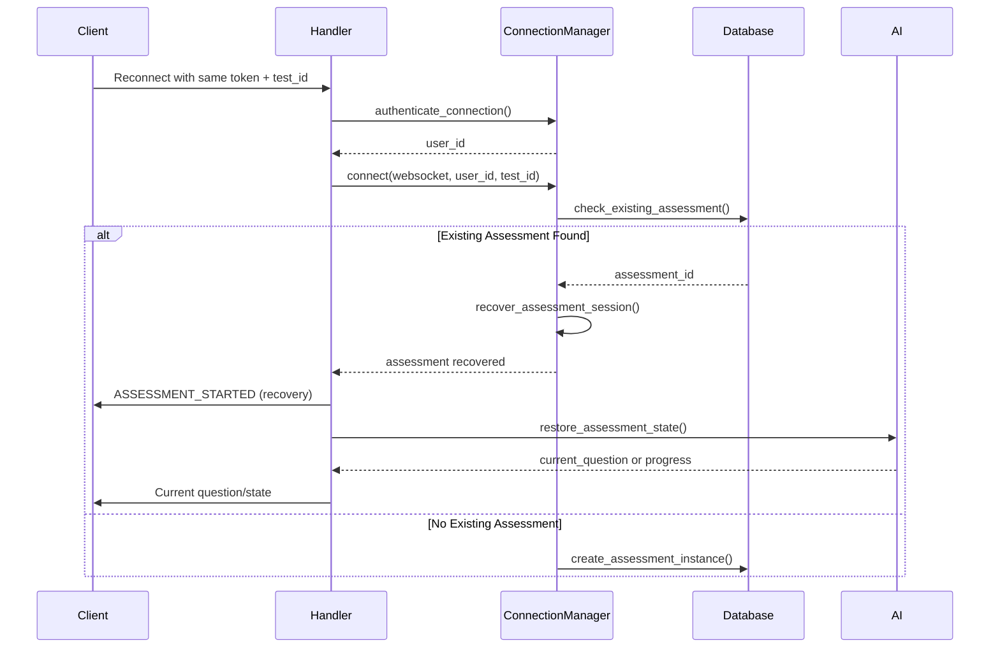

# WebSocket Architecture Documentation

## Overview

The WebSocket system provides real-time communication for AI-powered assessment sessions. It manages connection lifecycles, handles authentication, tracks assessment progress, and enables seamless reconnection with state recovery.

## Core Components

### 1. Connection Manager (`connection_manager.py`)

The `WebSocketConnectionManager` is the central orchestrator for all WebSocket connections.

#### Key Responsibilities:

- **Connection Lifecycle Management**: Track active connections and user sessions
- **Single Connection Policy**: Enforce one connection per user for assessment integrity
- **Authentication**: Validate JWT tokens for secure connection establishment
- **State Persistence**: Maintain assessment progress and connection metadata
- **Resource Cleanup**: Automatically remove inactive connections and free resources
- **Reconnection Support**: Enable seamless recovery of existing assessment sessions

#### Core Classes:

##### `ConnectionState`

Represents the state of a single WebSocket connection:

```python
class ConnectionState:
    websocket: WebSocket           # Active WebSocket connection
    user_id: int                  # Authenticated user identifier
    test_id: Optional[int]        # Test being taken (if in assessment)
    assessment_id: Optional[int]  # Assessment instance ID
    connected_at: datetime        # Connection establishment time
    last_activity: datetime       # Last message/activity timestamp
    assessment_started_at: datetime # When assessment began
    is_authenticated: bool        # Authentication status
    is_in_assessment: bool        # Whether actively taking assessment
    assessment_state: Dict        # Current progress and state data
```

##### `WebSocketConnectionManager`

Main connection orchestrator with data structures:

```python
class WebSocketConnectionManager:
    # Primary connection storage
    active_connections: Dict[str, ConnectionState]  # connection_id -> state

    # Single connection per user (enforces one connection per candidate)
    user_connections: Dict[int, str]               # user_id -> connection_id

    # Assessment session tracking
    assessment_sessions: Dict[int, Set[str]]       # test_id -> {connection_ids}
```

### Single Connection Policy

The system enforces **one connection per user** to maintain assessment integrity:

- When a user connects while having an existing connection, the old connection is automatically disconnected
- This prevents multiple browser tabs or devices from taking the same assessment simultaneously
- Ensures assessment state consistency and prevents cheating scenarios
- Simplifies connection management and reduces server resource usage

### 2. Message Handler (`handler.py`)

The `AssessmentWebSocketHandler` processes incoming messages and manages the assessment conversation flow.

#### Key Responsibilities:

- **Message Routing**: Direct messages to appropriate handlers based on type
- **Assessment Flow**: Orchestrate question generation, answer processing, and progress tracking
- **Error Handling**: Provide meaningful error responses and recovery
- **Integration**: Coordinate with AI services for dynamic question generation

## Connection Lifecycle

### 1. Initial Connection Flow



### 2. Assessment Start Flow



### 3. Message Processing Flow



## Message Types and Flow

### Connection Events

- `CONNECT`: Initial connection establishment
- `DISCONNECT`: Connection termination
- `AUTH_SUCCESS`: Authentication completed successfully
- `AUTH_FAILED`: Authentication failed

### Assessment Lifecycle

- `START_ASSESSMENT`: Begin assessment session
- `ASSESSMENT_STARTED`: Assessment initialized successfully
- `ASSESSMENT_ERROR`: Assessment initialization failed
- `ASSESSMENT_COMPLETED`: Assessment finished with results

### Question/Answer Flow

- `GET_QUESTION`: Request next question
- `QUESTION`: Send question to client
- `SUBMIT_ANSWER`: Submit answer for current question
- `ANSWER_FEEDBACK`: Provide feedback on submitted answer

### Progress and System

- `PROGRESS_UPDATE`: Update assessment progress
- `HEARTBEAT`/`PONG`: Keep-alive mechanism
- `ERROR`: Error message
- `CHAT_MESSAGE`/`SYSTEM_MESSAGE`: Conversational messages

## Disconnection and Reconnection Scenarios

### 1. Normal Disconnection

```python
# User closes browser/app
try:
    # WebSocket connection lost
    raise WebSocketDisconnect()
except WebSocketDisconnect:
    # Handler catches and cleans up
    await connection_manager.disconnect(connection_id)
    assessment_graph_service.cleanup_connection(connection_id)
```

### 2. Unexpected Disconnection

The system handles unexpected disconnections gracefully:

- **Connection State Preserved**: Assessment progress remains in database
- **Automatic Cleanup**: Background task removes stale connections after timeout
- **Assessment Recovery**: User can reconnect and resume where they left off

### 3. Reconnection Flow



### 4. Session Recovery Implementation

The system provides robust session recovery through several mechanisms:

#### Database Persistence

```python
async def check_existing_assessment(self, user_id: int, test_id: int, db: AsyncSession):
    """Check for recoverable assessment sessions"""
    assessment = await assessment_repo.get_user_assessment_for_test(user_id, test_id)

    if assessment and assessment.status in ['started', 'in_progress']:
        return assessment.assessment_id  # Can be recovered
    elif assessment.status in ['completed', 'abandoned']:
        return None  # Cannot be recovered
```

#### State Restoration

```python
async def recover_assessment_session(self, connection_id: str, assessment_id: int):
    """Restore assessment state from database"""
    assessment = await assessment_repo.get_assessment_by_id(assessment_id)

    # Restore connection state
    connection_state.start_assessment(assessment.test_id, assessment_id)

    # Restore AI service state
    await assessment_graph_service.restore_assessment_state(connection_id, assessment)
```

## Cleanup and Resource Management

### 1. Automatic Cleanup Task

```python
async def _cleanup_inactive_connections(self):
    """Background task running every 5 minutes"""
    while True:
        await asyncio.sleep(300)  # 5 minutes

        inactive_connections = []
        current_time = datetime.utcnow()

        for connection_id, state in self.active_connections.items():
            if (current_time - state.last_activity).total_seconds() > 1800:  # 30 min
                inactive_connections.append(connection_id)

        # Clean up inactive connections
        for connection_id in inactive_connections:
            await self.disconnect(connection_id)
```

### 2. Resource Cleanup on Disconnect

```python
async def disconnect(self, connection_id: str):
    """Complete cleanup of connection resources"""
    connection_state = self.active_connections[connection_id]

    # Remove from all tracking structures
    del self.active_connections[connection_id]
    self.user_connections[user_id].discard(connection_id)
    self.assessment_sessions[test_id].discard(connection_id)

    # Clean up empty sets
    if not self.user_connections[user_id]:
        del self.user_connections[user_id]
    if not self.assessment_sessions[test_id]:
        del self.assessment_sessions[test_id]
```

## Security Considerations

### 1. Authentication

- JWT token validation on connection
- User existence verification
- Token expiration handling

### 2. Authorization

- Test access validation
- Assessment eligibility checking
- User permission verification

### 3. Data Protection

- Secure message transmission
- Assessment state protection
- Connection isolation

## Best Practices for Clients

### 1. Connection Management

```javascript
// Implement exponential backoff for reconnection
let reconnectAttempts = 0;
const maxReconnectDelay = 30000; // 30 seconds

function reconnect() {
  const delay = Math.min(
    1000 * Math.pow(2, reconnectAttempts),
    maxReconnectDelay
  );
  setTimeout(() => {
    establishConnection();
    reconnectAttempts++;
  }, delay);
}
```

### 2. Heartbeat Implementation

```javascript
// Send heartbeat every 30 seconds
setInterval(() => {
  if (websocket.readyState === WebSocket.OPEN) {
    websocket.send(
      JSON.stringify({
        type: "heartbeat",
        data: { timestamp: new Date().toISOString() },
      })
    );
  }
}, 30000);
```

### 3. State Synchronization

```javascript
// Handle reconnection state sync
websocket.onopen = () => {
  if (hasExistingAssessment) {
    // Server will automatically recover state
    // Just wait for ASSESSMENT_STARTED message
  } else {
    // Start new assessment
    startAssessment();
  }
};
```

## Monitoring and Debugging

### 1. Connection Metrics

- Total active connections: `connection_manager.get_active_connections_count()`
- User connections: `connection_manager.get_user_connections_count(user_id)`
- Assessment participants: `connection_manager.get_assessment_participants_count(test_id)`

### 2. Connection Information

- Connection details: `connection_manager.get_connection_info(connection_id)`
- Assessment state: Available in `ConnectionState.assessment_state`

### 3. Logging

The system provides comprehensive logging for:

- Connection establishment/termination
- Authentication events
- Assessment lifecycle events
- Error conditions
- Cleanup operations

## Future Enhancements

1. **Load Balancing**: Support for multiple server instances with shared state
2. **Advanced Recovery**: Partial question state recovery
3. **Real-time Collaboration**: Multi-user assessment sessions
4. **Enhanced Security**: Connection rate limiting and DDoS protection
5. **Metrics Dashboard**: Real-time monitoring of connection health

This architecture provides a robust, scalable foundation for real-time assessment delivery with excellent user experience even in unstable network conditions.
